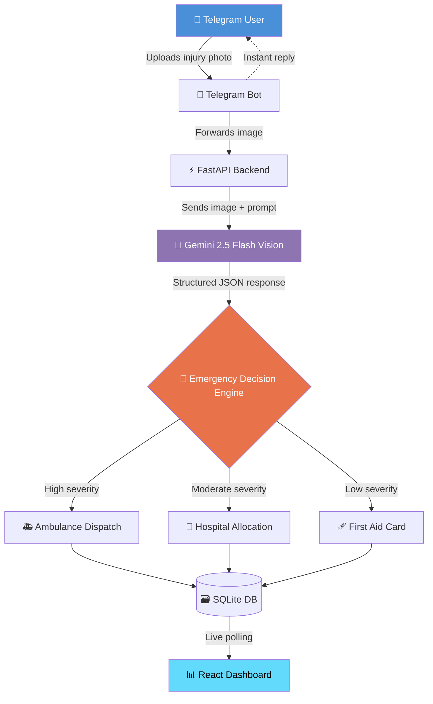
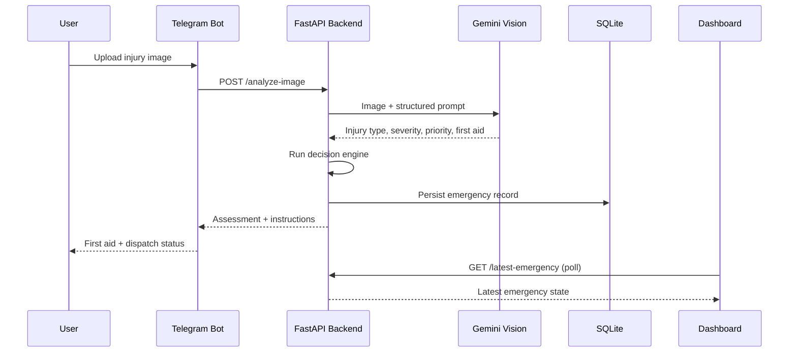
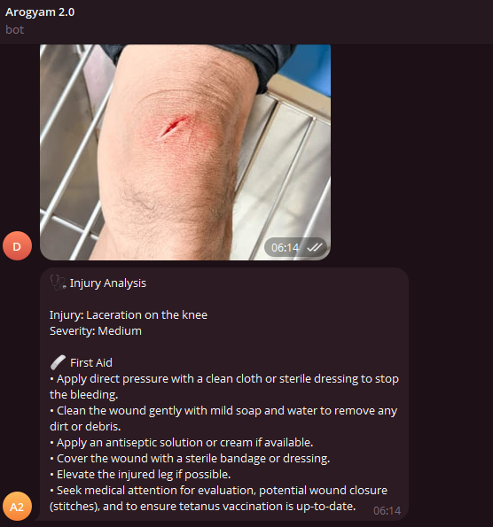
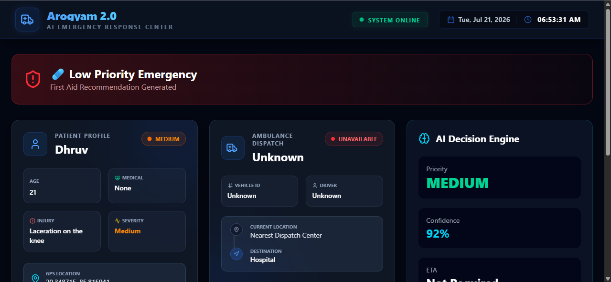
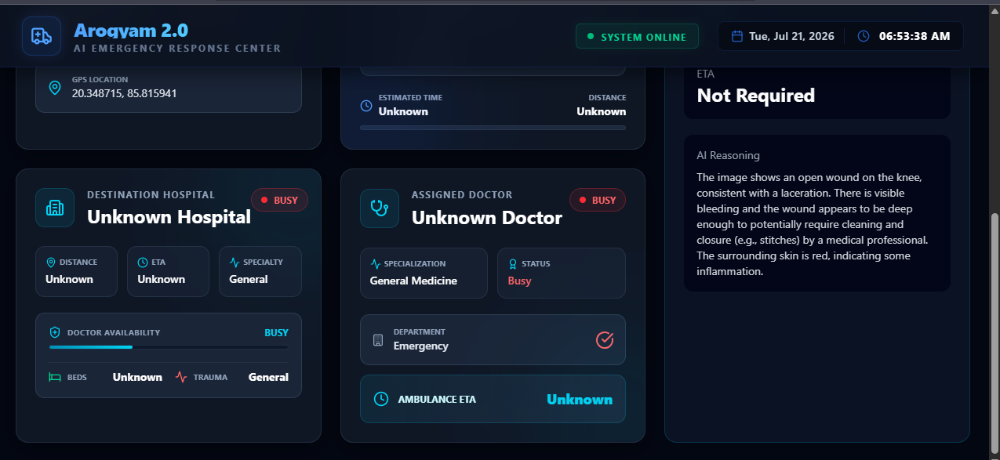
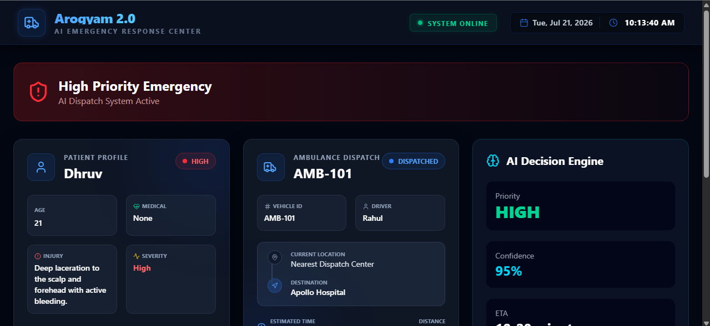
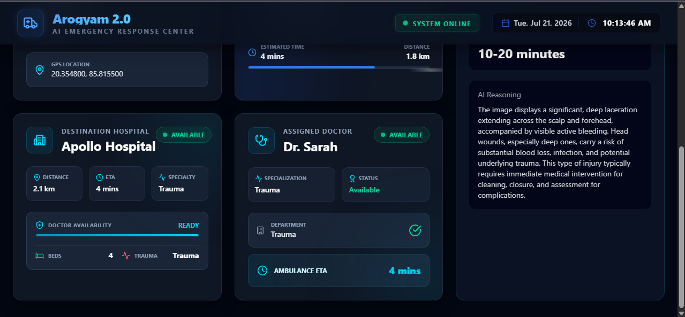

<div align="center">

# 🩺 Arogyam AI
### *(v2.0 — "Arogyam 2.0")*

### AI-Powered Emergency Injury Assessment & Smart Hospital Dispatch System

*Turning a photo into a life-saving decision — in seconds.*

[](https://www.python.org/)
[](https://fastapi.tiangolo.com/)
[](https://react.dev/)
[](https://ai.google.dev/)
[](https://core.telegram.org/bots/api)
[](https://openai.com/codex)

[](LICENSE)
[](CONTRIBUTING.md)
[]()
[]()

<br/>


<br/>


<br/>

**[▶ Watch the Live Demo](https://www.youtube.com/watch?v=G21vyl_xf0Y)** · **[Report Bug](../../issues)** · **[Request Feature](../../issues)** · **[Documentation](#-api-documentation)**

</div>

---

## 📖 Table of Contents

- [The Problem](#-the-problem)
- [The Solution](#-the-solution)
- [Features](#-features)
- [Tech Stack](#-tech-stack)
- [Architecture](#-architecture)
- [How It Works](#-how-it-works)
- [Live Demo](#-live-demo)
- [Screenshots](#-screenshots)
- [Folder Structure](#-folder-structure)
- [Getting Started](#-getting-started)
  - [Prerequisites](#prerequisites)
  - [Backend Setup](#1-backend-setup)
  - [Frontend Setup](#2-frontend-setup)
  - [Telegram Bot Setup](#3-telegram-bot-setup)
- [Environment Variables](#-environment-variables)
- [API Documentation](#-api-documentation)
- [Why Gemini?](#-why-gemini-25-flash-vision)
- [Built With Codex & GPT-5.6](#-built-with-codex--gpt-56)
- [Security Considerations](#-security-considerations)
- [Scalability](#-scalability)
- [Challenges Faced](#-challenges-faced)
- [Learnings](#-learnings)
- [Roadmap](#-roadmap--future-scope)
- [Contributing](#-contributing)
- [License](#-license)
- [Acknowledgements](#-acknowledgements)

---

## 🚨 The Problem

In the critical minutes after an injury, two things routinely go wrong:

- **Under-reaction** — people underestimate a serious injury and delay getting real medical help.
- **Over-reaction** — minor injuries trigger unnecessary emergency calls, tying up ambulances and hospital beds that someone else may need urgently.

Both failure modes share a root cause: **nobody at the scene is qualified to triage the injury in real time.** Arogyam AI puts a triage-trained "second opinion" in everyone's pocket.

## 💡 The Solution

Arogyam AI lets anyone **send a photo of an injury over Telegram** and get back a structured, medically-reasoned emergency assessment in seconds — including whether they need first aid, a hospital, or an ambulance, dispatched automatically to a live operations dashboard.

```
📸 Photo in  →  🧠 AI reasoning  →  🚑 Dispatch decision  →  📊 Live dashboard
```

No app to install. No form to fill. Just a photo and an answer.

---

## ✨ Features

| Category | Capability |
|---|---|
| 🧠 **AI Analysis** | Injury classification, severity scoring, and confidence estimation via Gemini 2.5 Flash Vision |
| 🤖 **Telegram Bot** | Zero-friction image intake — no app install required |
| ⚡ **FastAPI Backend** | Modular, async-first REST API for analysis and dispatch |
| 📊 **Live Dashboard** | Real-time polling dashboard built in React |
| 🏥 **Hospital Allocation** | Mock hospital resource matching based on severity and proximity |
| 👨‍⚕️ **Doctor Allocation** | Automatic assignment of on-call medical staff |
| 🚑 **Ambulance Dispatch** | Decision engine flags ambulance requirement + ETA |
| 🩹 **First Aid Engine** | Instant, actionable first-aid guidance while help is en route |
| 🎯 **Priority Classification** | Emergencies ranked and queued by urgency |
| 🗃️ **SQLite Storage** | Lightweight, dependency-free persistence layer |
| 🔌 **REST API** | Clean, documented endpoints for integration |

---

## 🛠 Tech Stack

<table>
<tr>
<td valign="top" width="25%">

**Frontend**
- React
- Vite
- JavaScript (ES6+)
- CSS3

</td>
<td valign="top" width="25%">

**Backend**
- FastAPI
- Python 3.10+
- Uvicorn (ASGI)

</td>
<td valign="top" width="25%">

**AI / ML**
- Gemini 2.5 Flash Vision
- Prompt-based structured extraction

</td>
<td valign="top" width="25%">

**Messaging & Data**
- Telegram Bot API
- SQLite
- Git & GitHub

</td>
</tr>
</table>

---

## 🏗 Architecture



### Sequence of a Single Emergency



---

## ⚙️ How It Works

| Step | Action |
|:---:|---|
| 1️⃣ | User uploads an injury image via Telegram |
| 2️⃣ | Telegram Bot forwards it to the backend |
| 3️⃣ | FastAPI backend receives and preprocesses the request |
| 4️⃣ | Gemini 2.5 Flash Vision analyzes the image |
| 5️⃣ | AI returns a structured emergency assessment |
| 6️⃣ | Decision engine determines ambulance/hospital need |
| 7️⃣ | Dashboard updates in real time |
| 8️⃣ | First aid recommendations are shown to the user |

---

## 🎬 Live Demo


<div align="center">

[](https://www.youtube.com/watch?v=G21vyl_xf0Y)

**▲ Click to watch on YouTube**

</div>

The demo walks through the full pipeline end-to-end: a real injury photo sent on Telegram, Gemini's structured analysis coming back with first aid instructions, and the dashboard updating live with priority, ambulance dispatch, and hospital assignment — with a voiceover covering **how Codex and GPT-5.6 were used to build the repo.**

---
## 📸 Screenshots

### Telegram Bot — Live Injury Analysis

<p align="center">
  
</p>

*A real submission: knee laceration detected as **Medium** severity, with structured first aid steps (pressure, cleaning, antiseptic, bandaging, elevation, and a note to check tetanus vaccination status).*

---

### Dashboard — Low Priority Case

<table>
<tr>
<td align="center" width="50%">

</td>
<td align="center" width="50%">

</td>
</tr>
</table>

*The same knee laceration case reflected on the operations dashboard — **Medium** priority, **92% confidence**, ambulance marked **"Not Required"**, and the AI's complete reasoning displayed alongside hospital and doctor availability.*

---

### Dashboard — High Priority Case

<table>
<tr>
<td align="center" width="50%">

</td>
<td align="center" width="50%">

</td>
</tr>
</table>

*A deep scalp and forehead laceration with active bleeding classified as **High Priority** with **95% confidence**. The system automatically dispatched **Ambulance AMB-101**, assigned **Dr. Sarah** from **Apollo Hospital**, and estimated a **4-minute arrival time** while displaying the AI's medical reasoning.*

---

## 📁 Folder Structure

```
arogyam-ai/
├── backend/
│   ├── app/
│   │   ├── main.py              # FastAPI entrypoint
│   │   ├── routes/               # API route handlers
│   │   ├── services/             # Gemini integration, decision engine
│   │   ├── models/               # Pydantic + DB models
│   │   └── db/                   # SQLite setup & queries
│   ├── requirements.txt
│   └── .env.example
│
├── frontend/
│   ├── src/
│   │   ├── components/           # Dashboard UI components
│   │   ├── pages/
│   │   ├── hooks/
│   │   └── App.jsx
│   ├── package.json
│   └── vite.config.js
│
├── telegram-bot/
│   ├── bot.py                    # Bot entrypoint & handlers
│   ├── requirements.txt
│   └── .env.example
│
├── docs/
│   └── assets/                   # Screenshots, banners, diagrams
│
├── LICENSE
└── README.md
```

---

## 🚀 Getting Started

### Prerequisites

- Python **3.10+**
- Node.js **18+** and npm
- A [Gemini API key](https://ai.google.dev/)
- A [Telegram Bot Token](https://core.telegram.org/bots#botfather) from @BotFather

### 1. Backend Setup

```bash
# Clone the repository
git clone https://github.com/<your-username>/arogyam-ai.git
cd arogyam-ai/backend

# Create and activate a virtual environment
python -m venv venv
source venv/bin/activate      # On Windows: venv\Scripts\activate

# Install dependencies
pip install -r requirements.txt

# Configure environment variables
cp .env.example .env
# then fill in GEMINI_API_KEY

# Run the backend
uvicorn app.main:app --reload --port 8000
```

The API will be live at `http://localhost:8000` with interactive docs at `http://localhost:8000/docs`.

### 2. Frontend Setup

```bash
cd ../frontend

# Install dependencies
npm install

# Run the development server
npm run dev
```

The dashboard will be live at `http://localhost:5173`.

### 3. Telegram Bot Setup

```bash
cd ../telegram-bot

# Install dependencies
pip install -r requirements.txt

# Configure environment variables
cp .env.example .env
# then fill in BOT_TOKEN

# Run the bot
python bot.py
```

Send an injury photo to your bot on Telegram to trigger the full pipeline.

> ✅ **For judges/reviewers:** sample injury images are provided in `docs/sample-images/` — send any of these to the bot to test the full pipeline without needing your own photos.

---

## 🔐 Environment Variables

**`backend/.env`**

```env
GEMINI_API_KEY=your_gemini_api_key_here
```

**`telegram-bot/.env`**

```env
BOT_TOKEN=your_telegram_bot_token_here
```

> ⚠️ Never commit real `.env` files. `.env.example` files are provided as templates.

---

## 📡 API Documentation

### `POST /analyze-image`

Analyzes an uploaded injury image and returns a structured emergency assessment.

**Request:** `multipart/form-data` with an `image` file field.

**Response:**

| Field | Type | Description |
|---|---|---|
| `injury` | `string` | Detected injury type |
| `severity` | `string` | `Low` \| `Moderate` \| `High` \| `Critical` |
| `priority` | `string` | Dispatch priority level |
| `confidence` | `float` | Model confidence score (0–1) |
| `reasoning` | `string` | Medical rationale behind the assessment |
| `hospital` | `boolean` | Whether hospital admission is recommended |
| `doctor` | `string \| null` | Allocated on-call doctor, if any |
| `ambulance` | `boolean` | Whether ambulance dispatch is required |
| `eta` | `string` | Estimated time of arrival |
| `first_aid` | `string[]` | Step-by-step first aid instructions |

<details>
<summary>Example Response — High Priority Case (from actual demo run)</summary>

```json
{
  "injury": "Deep laceration to the scalp and forehead with active bleeding",
  "severity": "High",
  "priority": "High",
  "confidence": 0.95,
  "reasoning": "The image displays a significant, deep laceration extending across the scalp and forehead, accompanied by visible active bleeding. Head wounds, especially deep ones, carry a risk of substantial blood loss, infection, and potential underlying trauma. This type of injury typically requires immediate medical intervention for cleaning, closure, and assessment for complications.",
  "hospital": true,
  "doctor": "Dr. Sarah - Trauma",
  "ambulance": true,
  "eta": "4 mins",
  "first_aid": [
    "Apply firm, direct pressure with a clean cloth",
    "Do not remove any embedded objects",
    "Keep the person still and calm until help arrives",
    "Monitor for signs of shock or loss of consciousness"
  ]
}
```

</details>

<details>
<summary>Example Response — Low Priority Case (from actual demo run)</summary>

```json
{
  "injury": "Laceration on the knee",
  "severity": "Medium",
  "priority": "Medium",
  "confidence": 0.92,
  "reasoning": "The image shows an open wound on the knee, consistent with a laceration. There is visible bleeding and the wound appears to be deep enough to potentially require cleaning and closure (e.g., stitches) by a medical professional. The surrounding skin is red, indicating some inflammation.",
  "hospital": false,
  "doctor": null,
  "ambulance": false,
  "eta": "Not Required",
  "first_aid": [
    "Apply direct pressure with a clean cloth to stop bleeding",
    "Clean the wound gently with mild soap and water",
    "Apply an antiseptic solution or cream if available",
    "Cover the wound with a sterile bandage",
    "Seek medical attention for evaluation and tetanus check"
  ]
}
```

</details>

### `GET /latest-emergency`

Returns the most recent emergency record for dashboard polling.

**Response:** Same shape as `/analyze-image`, plus a `timestamp` field.

---

## 🤔 Why Gemini 2.5 Flash Vision?

Gemini 2.5 Flash Vision was chosen over alternatives for a specific reason: **speed without sacrificing structured reasoning.** Emergency triage is a latency-sensitive problem — a brilliant answer that takes 30 seconds is worse than a good answer in 3. Flash Vision's low-latency multimodal inference made it possible to keep the "photo to decision" loop fast enough to be genuinely useful in a real emergency, while still returning well-reasoned, structured medical insights rather than free-form text — as shown in the reasoning fields captured directly from the demo runs above.

---

## 🧩 Built With Codex & GPT-5.6

This project leaned on Codex and GPT-5.6 as an active engineering partner throughout the entire build — not just for boilerplate. Here's exactly where and how:

| Build Phase | How Codex / GPT-5.6 Was Used |
|---|---|
| **Backend scaffolding** | Codex generated the initial FastAPI route structure, Pydantic response models, and SQLite schema for `/analyze-image` and `/latest-emergency`, which we then reviewed and hardened by hand |
| **Prompt engineering** | GPT-5.6 was used to iteratively design and stress-test the structured-output prompt sent to Gemini — the goal was reliable JSON (`injury`, `severity`, `priority`, `confidence`, `reasoning`, `first_aid`) instead of free-form medical prose, which took several rounds of prompt refinement |
| **Decision engine logic** | Codex helped translate severity/confidence thresholds (e.g. High severity + ≥90% confidence → auto-dispatch ambulance) into clean, testable Python conditionals |
| **Telegram bot handlers** | Scaffolded the image-upload handler and the formatted reply template (Injury / Severity / First Aid) shown in the bot screenshot above |
| **Dashboard polling logic** | Assisted in writing the React polling hook and loading/error states around `GET /latest-emergency` |
| **Debugging & edge cases** | Used heavily to trace malformed AI responses, image upload validation failures, and race conditions between bot replies and dashboard polling |
| **Documentation** | This very README — structure, Mermaid diagrams, and API docs — was drafted with GPT-5.6 assistance and refined against real screenshots and actual API responses from the running app |

**What we did *not* outsource:** the problem framing, the severity/priority decision thresholds, the choice of Gemini for vision reasoning, and the final review of every AI-generated line before it was merged. Codex accelerated the build significantly — realistically cutting boilerplate and debugging time by a large margin — but every architectural and medical-safety decision was made and verified by the team.

> 🎙️ The [live demo video](#-live-demo) includes a voiceover walking through this Codex + GPT-5.6 workflow in detail, including real prompts used during development.

---

## 🔒 Security Considerations

- Injury images are processed transiently and are not retained beyond what's needed for the current session.
- API keys and bot tokens are loaded exclusively from environment variables, never hardcoded.
- Input validation is enforced on all upload endpoints to reject non-image payloads.
- Rate limiting is recommended in production to prevent abuse of the Gemini API quota.
- This project is a **prototype / hackathon submission** and is **not** a certified medical device — see [Disclaimer](#-license).

---

## 📈 Scalability

The current SQLite-based architecture is intentionally lightweight for demo purposes. The system is designed so each layer can be swapped independently as load grows:

| Component | Current | Scale Path |
|---|---|---|
| Database | SQLite | PostgreSQL / managed cloud DB |
| Backend | Single FastAPI instance | Horizontally scaled with a load balancer |
| Dashboard updates | Polling | WebSockets / Server-Sent Events |
| Image handling | Local processing | Object storage (S3-compatible) + async queue |
| AI inference | Direct API calls | Queued/batched requests with retry & backoff |

---

## 🧗 Challenges Faced

- **Prompt reliability** — getting Gemini to consistently return clean, structured JSON (rather than prose) required iterating on prompt design and adding response parsing safeguards.
- **Latency budgeting** — balancing image quality sent to the model against response time to keep the Telegram interaction feeling instant.
- **Decision engine calibration** — mapping AI confidence and severity into ambulance/hospital decisions without over- or under-triggering dispatch, visible in the contrast between the Medium (no ambulance) and High (ambulance dispatched, 4 min ETA) cases above.
- **Live dashboard sync** — keeping the dashboard state consistent with the backend using simple polling, without introducing stale data.

## 📚 Learnings

- Designing prompts for **structured, parseable output** is a discipline of its own, distinct from general prompt engineering.
- A good emergency system optimizes for **decisiveness under uncertainty**, not just accuracy — a confident "get help now" beats a hedge.
- Keeping the user-facing interface (Telegram) dead simple was more valuable than building a custom app, especially for hackathon judging and real-world usability.
- Using Codex/GPT-5.6 as a pair programmer meaningfully shifted where our time went: less time on boilerplate and syntax, more time on decision-engine correctness and prompt reliability — the parts that actually matter for a safety-relevant system.

---

## 🗺 Roadmap & Future Scope

- [ ] 🛰️ Live GPS tracking for real-time ambulance location
- [ ] 🗺️ Nearby hospital discovery via Maps API
- [ ] 📄 OCR support for reading prescriptions and medical documents
- [ ] 📞 Voice-based emergency calling
- [ ] 🌐 Multi-language support for wider accessibility
- [ ] 🧾 Medical history integration for personalized triage
- [ ] ⌚ Wearable device integration for automatic incident detection
- [ ] 🚑 Integration with real ambulance dispatch APIs
- [ ] 🏥 Hospital ERP system integration
- [ ] 🧠 Improved AI explainability for medical reasoning

---

## 🤝 Contributing

Contributions are what make the open-source community such an amazing place to learn and build. Any contributions are **greatly appreciated**.

1. Fork the repository
2. Create your feature branch (`git checkout -b feature/AmazingFeature`)
3. Commit your changes (`git commit -m 'Add some AmazingFeature'`)
4. Push to the branch (`git push origin feature/AmazingFeature`)
5. Open a Pull Request

Please open an issue first for major changes to discuss what you'd like to change.

---

## 📄 License

Distributed under the **MIT License**. See [`LICENSE`](LICENSE) for more information.

> **Medical Disclaimer:** Arogyam AI is a prototype built for educational and hackathon purposes. It is **not** a certified medical device and should **never** replace professional medical judgment or emergency services. In a real emergency, always contact your local emergency number first.

---

## 🙏 Acknowledgements

- [Google Gemini](https://ai.google.dev/) for multimodal vision capabilities
- [OpenAI Codex & GPT-5.6](https://openai.com/codex) for accelerating backend scaffolding, prompt iteration, and debugging throughout Build Week
- [FastAPI](https://fastapi.tiangolo.com/) for a delightful backend developer experience
- [React](https://react.dev/) + [Vite](https://vitejs.dev/) for a fast, modern frontend
- [Telegram Bot API](https://core.telegram.org/bots/api) for frictionless user intake
- Everyone who tested early versions and gave feedback during the hackathon

---

<div align="center">

**If Arogyam AI helped or inspired you, consider giving it a ⭐!**

Made with ❤️ (and a lot of Codex) for a future where no one has to wonder *"is this serious enough?"* alone.

</div>